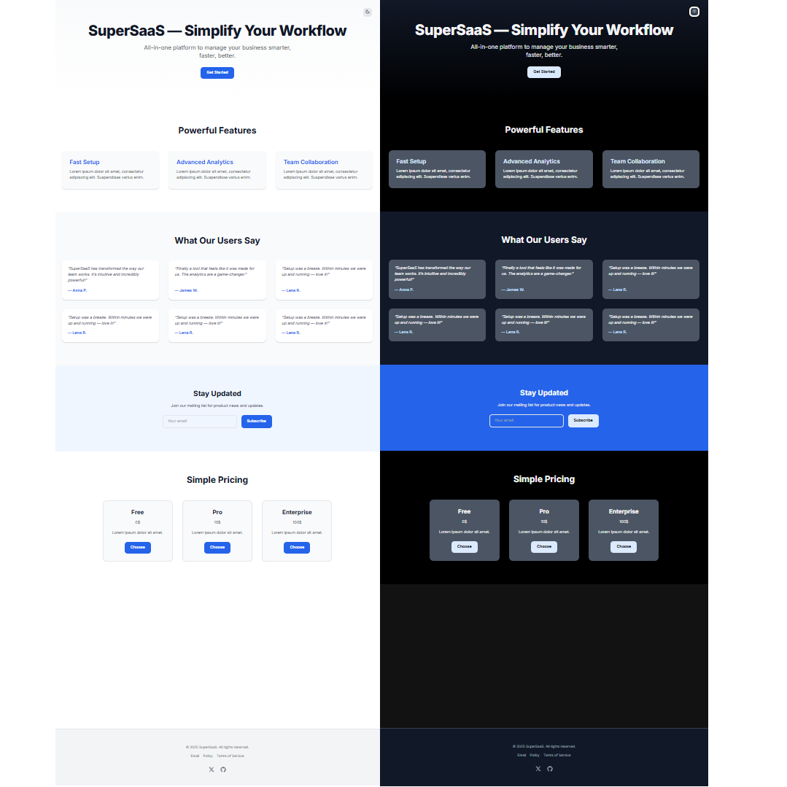

# 🧩 SaaS Hero Section Template — Next.js + Tailwind

A clean and responsive **SaaS hero section** built with **Next.js 14**, **Typescript^5**, **Tailwind CSS**, **MaterialUI**, and **Framer Motion**. Comes with dark/light mode, testimonials, pricing, and call-to-action sections — perfect for landing pages or MVPs.

---

## ✨ Features

- ⚡️ Next.js 14 (App Router)
- 🎨 Tailwind CSS styling
- 🌙 Dark & Light themes (with toggle)
- 🧠 SEO-optimized structure
- 🎬 Framer Motion animations
- 📱 Fully responsive
- 🧪 Clean, reusable components
- 🧾 Hero, Features, Testimonials, Pricing, and Signup sections
- 🧑‍💻 Ready to deploy

---

## 📸 Preview



---

## 🚀 Getting Started

1. **Clone the repo**

```bash
git clone https://github.com/yevhenii-sulim/saas-hero-template.git
cd saas-hero-template
```

````md
2. **Install dependencies**

```bash
npm install

🛠️ Customization
The components are located in:

components/: Hero, Features, Feedback, Pricing, etc.

app/: Layout, ThemeProvider, and page routing

sections/: sections of HomePage

constants/: constants for the project

You can easily update text, colors, icons, and sections for your product.

📦 Deployment
This project is ready to deploy on:

Vercel (recommended)

Netlify

Your own VPS

📄 License
This template is available for personal and commercial use.
You are not allowed to resell or redistribute the template.

🛍️ Buy the Template
Want the ZIP, updates, and official license?


👉 Buy on Gumroad
```
````
